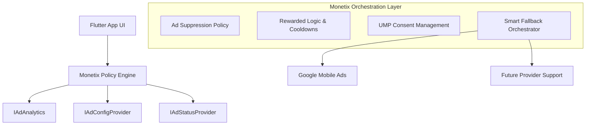
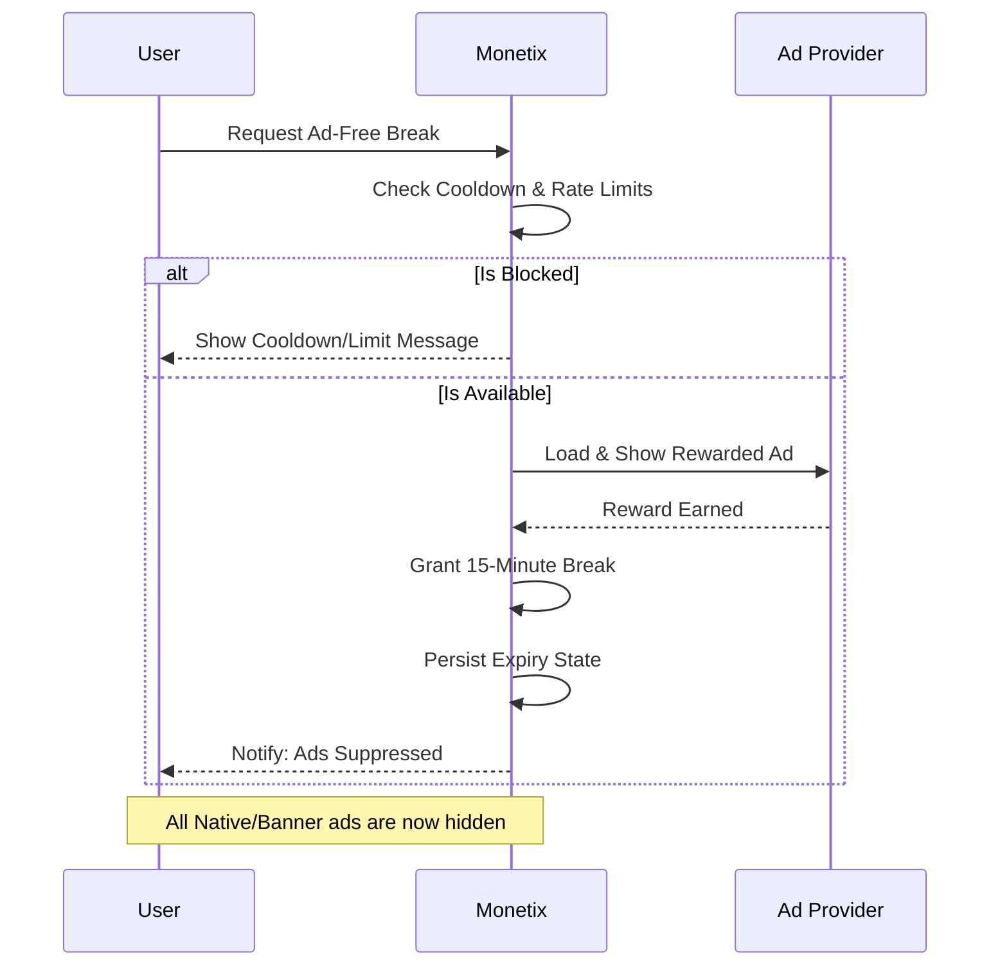

# Monetix Flutter

[](https://pub.dev/packages/monetix_flutter)
[](https://pub.dev/packages/monetix_flutter/score)
[](https://pub.dev/packages/monetix_flutter/score)
[](https://github.com/stfleurs/monetix_flutter/blob/main/LICENSE)

**The Monetization Orchestration Ecosystem for Flutter.**

Monetix is not just an ad SDK wrapper — it's a policy-driven orchestration layer that manages the complex relationship between your revenue strategy, your user experience, and your premium states.

---

## Core Philosophy

> **Monetix treats monetization as a product system — not just an implementation detail.**

The goal is to maximize long-term revenue without degrading user experience. We believe that a happy user is a more valuable user, which is why Monetix prioritizes policy-driven ad suppression and incentivized "ad-free breaks" over mindless ad frequency.

---

## Showcase

### 🎥 Live Reactive Demo


### 📸 Component Gallery
| Playground Home | Rewarded Break | Debug Control Center |
| :---: | :---: | :---: |
|  |  |  |

---

## Architecture Overview

Monetix sits as an orchestration layer between your App UI and the underlying Ad Providers.



---

## The "Ad-Free Break" Flow

Our signature feature: Let users "buy" time with a single rewarded ad, reducing fatigue and increasing engagement.



---

## Why Monetix?

Most ad packages are just widget wrappers. Monetix is a **strategy engine** that lets you define *how* and *when* ads appear based on real-time app state.

### Problems Monetix Solves
- 🍝 **Scattered Logic**: No more ad checks and premium suppression scattered across your UI.
- 📉 **Revenue Leakage**: `MonetizedNativeAd` automatically falls back to Banners if high-value Native ads fail.
- 😫 **User Frustration**: Handles the complex logic of rewarded breaks, rate limits, and cooldowns out of the box.
- 🔓 **Provider Lock-in**: Interface-driven design lets you swap or mock providers (AdMob, RevenueCat, Custom) easily.

---

## Quick Start

### 1. Install

```yaml
dependencies:
  monetix_flutter: ^0.0.1
```

### 2. Implement the Interfaces

Create a class that implements `IAdStatusProvider` (e.g., wrapping RevenueCat) and `IAdConfigProvider` (e.g., wrapping Firebase Remote Config).

Both interfaces extend `Listenable`, so your implementation **must** also extend `ChangeNotifier` (or another `Listenable`) to enable reactive UI updates.

```dart
class MyPremiumStatus extends ChangeNotifier implements IAdStatusProvider {
  bool _isPremium = false;
  final _controller = StreamController<bool>.broadcast();

  @override bool get isPremium => _isPremium;
  @override Stream<bool> get premiumStatusStream => _controller.stream;

  void onSubscriptionChanged(bool isPremium) {
    _isPremium = isPremium;
    _controller.add(isPremium);
    notifyListeners(); // Triggers UI rebuild
  }

  // ... implement remaining label/string getters
}
```

### 3. Wire Up the Provider Tree

Use `ListenableProxyProvider` to expose your implementations as the Monetix interfaces. This is what enables **reactive premium suppression** — ads disappear the instant `notifyListeners()` is called.

```dart
void main() {
  WidgetsFlutterBinding.ensureInitialized();
  Provider.debugCheckInvalidValueType = null; // Required for interface injection
  runApp(const MyApp());
}

class MyApp extends StatelessWidget {
  @override
  Widget build(BuildContext context) {
    return MultiProvider(
      providers: [
        // 1. Your status provider (e.g. RevenueCat)
        ChangeNotifierProvider<MyPremiumStatus>(
          create: (_) => MyPremiumStatus(),
        ),
        // Expose as interface — use ListenableProxyProvider for reactivity
        ListenableProxyProvider<MyPremiumStatus, IAdStatusProvider>(
          update: (_, status, __) => status,
        ),

        // 2. Your config provider (e.g. Firebase Remote Config)
        ChangeNotifierProvider<MyAdConfig>(
          create: (_) => MyAdConfig(),
        ),
        ListenableProxyProvider<MyAdConfig, IAdConfigProvider>(
          update: (_, config, __) => config,
        ),

        // 3. Analytics (optional)
        Provider<IAdAnalytics>(create: (_) => ConsoleAdAnalytics()),

        // 4. Rewarded Ad Service
        ChangeNotifierProxyProvider2<MyAdConfig, IAdAnalytics, RewardedMonetizationService>(
          create: (ctx) => RewardedMonetizationService(
            ctx.read<MyAdConfig>(),
            analyticsService: ctx.read<IAdAnalytics>(),
          ),
          update: (_, __, ___, prev) => prev!,
        ),

        // 5. Main Orchestrator
        Provider<MonetizationService>(
          create: (ctx) {
            final svc = MonetizationService(
              ctx.read<MyAdConfig>(),
              statusProvider: ctx.read<MyPremiumStatus>(),
              analyticsService: ctx.read<IAdAnalytics>(),
              rewardedAdService: ctx.read<RewardedMonetizationService>(),
            );
            svc.init();
            return svc;
          },
        ),
      ],
      child: MaterialApp(home: MyHomePage()),
    );
  }
}
```

### 4. Add Widgets

```dart
// Automatically hides when user is premium or in an ad-free break
MonetizedNativeAd(screen: 'home', placement: 'main_feed')

// Standalone banner (falls back gracefully if native fails)
MonetizedBannerAd(screen: 'home', placement: 'footer')
```

---

## Implementation Modes

### ⚡ Quick Mode
Ideal for testing or simple apps. Uses default console logging and in-memory status.

### 🛠️ Advanced Mode
For production apps. Implement the core interfaces to link your own services:
- **Remote Config**: Manage IDs and frequencies remotely.
- **Analytics**: Connect Firebase, Mixpanel, or Amplitude.
- **RevenueCat**: React to subscription states instantly.

---

## Monetix Playground

The `/example` directory contains an **Interactive Showcase App** demonstrating:
- **Reactive Premium Suppression**: Watch ads disappear instantly when status changes.
- **Smart Fallbacks**: Native ads transitioning to Banners seamlessly.
- **Incentivized Flow**: A fully working "Ad-Free Break" sheet.
- **Debug Control Center**: Toggle states live to test your app's behavior.

## License

MIT
