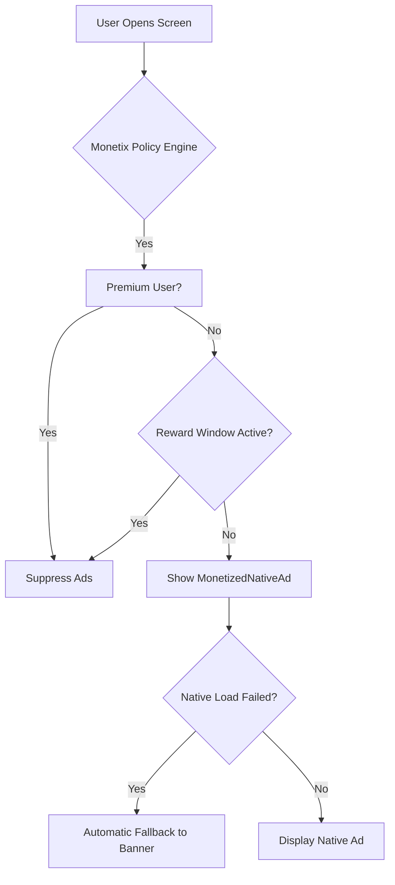

# Monetix Flutter

[](https://pub.dev/packages/monetix_flutter)
[](https://pub.dev/packages/monetix_flutter/score)
[](https://pub.dev/packages/monetix_flutter/score)
[](https://github.com/stfleurs/monetix_flutter/blob/main/LICENSE)

**Production-ready monetization orchestration for Flutter apps.**

Handle ads, premium users, rewarded incentives, consent, analytics, and fallback strategies through one clean architecture layer.

---

## Why Monetix?

Most ad packages are just widget wrappers. Monetix is a **policy engine** that manages the complex relationship between your revenue strategy and your user experience.

### The Problem
- 🍝 **Spaghetti Logic**: Ad checks and premium suppression scattered across your UI.
- 📉 **Revenue Loss**: High-value native ads failing and leaving empty spaces.
- 😫 **Ad Fatigue**: Users getting frustrated with constant interruptions.
- 🔒 **SDK Lock-in**: Hard to switch or mock ad providers for testing.

### The Monetix Solution
- 🎯 **Centralized Policy**: One place to define ad-free rules and premium states.
- 🛡️ **Resilient Fallbacks**: Automatic Native-to-Banner orchestration.
- 🎁 **Incentivized UX**: Built-in "15-minute ad-free break" rewarded flow.
- 🔌 **Interface-Driven**: Easily swap analytics, config, or status providers.

---

## How it Works



---

## Quick Start

### 1. Initialize

```dart
await Monetix.initialize(
  bannerId: 'ca-app-pub-3940256099942544/6300978111',
  nativeId: 'ca-app-pub-3940256099942544/2247696110',
);
```

### 2. Add Widgets

```dart
MonetizedNativeAd(
  screen: 'home',
  placement: 'main_feed',
)
```

---

## Implementation Modes

### ⚡ Quick Mode
Ideal for testing or simple apps. Uses default console logging and in-memory status.

```dart
final ads = Monetix.instance;
final rewards = Monetix.rewarded;
```

### 🛠️ Advanced Mode
For production apps. Implement the core interfaces to link your own services.

```dart
class MyAdConfig extends IAdConfigProvider { ... }
class MyAdAnalytics extends IAdAnalytics { ... }
class MyAdStatus extends IAdStatusProvider { ... }

await Monetix.initialize(
  config: MyAdConfig(),
  analytics: MyAdAnalytics(),
  status: MyAdStatus(),
);
```

---

## Example App

The `/example` directory contains a professional demonstration of the **"Ad-Free Break"** flow, reactive premium suppression, and fallback orchestration.

## License

MIT
