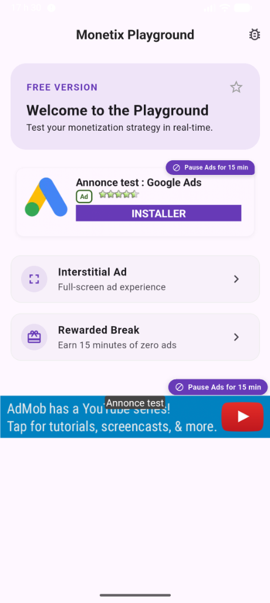
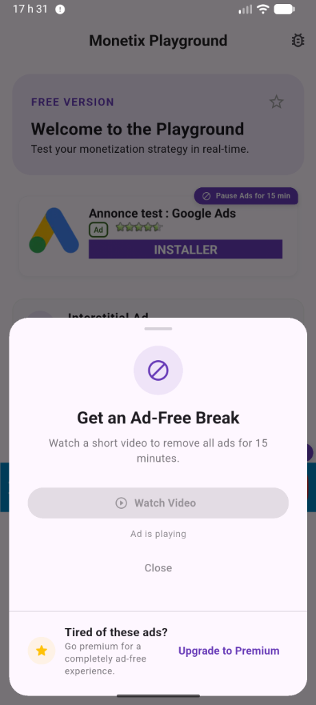
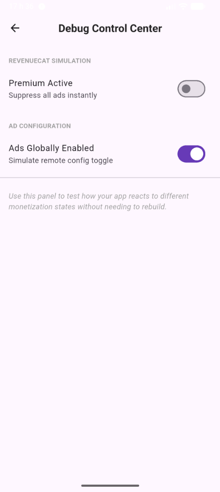
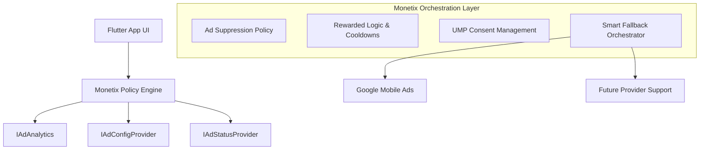
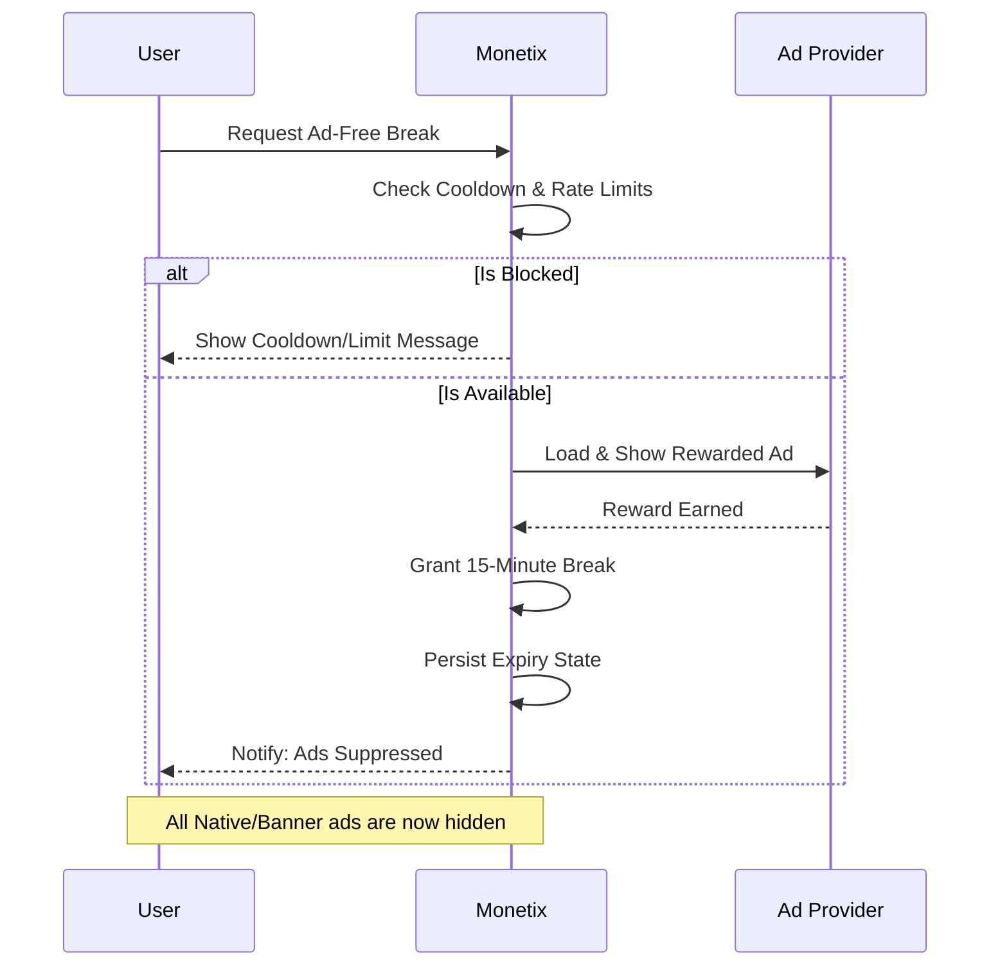

# Monetix Flutter

[](https://pub.dev/packages/monetix_flutter)
[](https://pub.dev/packages/monetix_flutter/score)
[](https://pub.dev/packages/monetix_flutter/score)
[](https://github.com/stfleurs/monetix_flutter/blob/main/LICENSE)

<p align="center">
  
</p>

**The Monetization Orchestration Ecosystem for Flutter.**

Monetix is not just an ad SDK wrapper — it's a policy-driven orchestration layer that manages the complex relationship between your revenue strategy, your user experience, and your premium states.

---

Monetix works out of the box with zero provider setup required in your widget tree! Our widgets utilize a **hybrid resolution model**—they first try to look up your dependencies via standard `Provider` injection, and if not present, gracefully fall back to the global singleton instances initialized by `Monetix.initialize(...)`.

To start simple:

1. Initialize in `main()`:
```dart
await Monetix.initialize(
  bannerId: 'ca-app-pub-...',
  nativeId: 'ca-app-pub-...',
);
```

2. Drop a widget anywhere in your app:
```dart
MonetizedBannerAd(
  screen: 'home',
  placement: 'footer',
)
```

---

## Core Philosophy

> **Monetix treats monetization as a product system — not just an implementation detail.**

The goal is to maximize long-term revenue without degrading user experience. We believe that a happy user is a more valuable user, which is why Monetix prioritizes policy-driven ad suppression and incentivized "ad-free breaks" over mindless ad frequency.

---

Monetix is ideal for:
- Freemium & utility apps.
- Apps with both subscriptions and ads.
- Teams needing to control monetization remotely.

### 🛑 When NOT to use Monetix
Monetix may be excessive if your app only needs a single static banner ad and has no premium/subscription logic. If you don't need ad suppression or fallback logic, the raw `google_mobile_ads` package is simpler.

---

## Real-World Scenario

Orchestration systems become easier to understand through workflows. Here is a typical Monetix scenario:

- **Free users** see ads.
- **Premium users** instantly suppress ads.
- **Rewarded users** get 15 ad-free minutes.
- **Native ads** fallback to banners automatically.
- **Remote config** controls ad frequency.

---

## Showcase

### 📸 Component Gallery
| Playground Home | Rewarded Break | Debug Control Center |
| :---: | :---: | :---: |
|  |  |  |

---

## Flexibility & Control

Monetix is designed to be configurable. Every major orchestration feature can be toggled or customized to fit your specific app strategy.

| Feature | Configurable |
| :--- | :---: |
| Banner ads | ✅ |
| Native ads | ✅ |
| Rewarded ad breaks | ✅ |
| Fallback ads | ✅ |
| Orchestration | ✅ |

---

## Architecture Overview

Monetix sits as an orchestration layer between your App UI and the underlying Ad Providers.



### 🏗️ The Three Layers of Monetix

Monetix is built as a modular system, allowing you to use as much or as little as you need.

*   **Core Layer**: The "brains" of the system. Handles ad suppression policies, fallback logic, rate limits, and provider interfaces.
*   **UI Layer**: Premium, drop-in widgets like `MonetizedNativeAd` and `MonetizedBannerAd` that are policy-aware and react to state changes instantly.
*   **Developer Tools Layer**: Pre-built admin panels (`MonetixDebugPanel`) and safety gates (`MonetixAdminGate`) to control your monetization strategy live in production.

---

## The "Ad-Free Break" Flow

Our signature feature: Let users "buy" time with a single standard rewarded ad, reducing fatigue and increasing engagement. (Note: This uses the standard `RewardedAd` format, not `RewardedInterstitialAd`).



---

## Why Monetix?

Most ad packages are just widget wrappers. Monetix is a **strategy engine** that lets you define *how* and *when* ads appear based on real-time app state.

### ⚡ Quick Comparison

| Feature | Typical Ad Wrapper | Monetix |
| --- | :---: | :---: |
| **Reactive premium suppression** | Manual | ✅ Built-in |
| **Rewarded ad-free breaks** | Manual | ✅ Built-in |
| **Fallback orchestration** | Rare | ✅ Built-in |
| **Debug/admin tooling** | Absent | ✅ Built-in |
| **Remote-config ready** | Manual | ✅ Built-in |

### Problems Monetix Solves
- 🍝 **Scattered Logic**: No more ad checks and premium suppression scattered across your UI. Centralized policy evaluation under `MonetizationGate` ensures ads always respect dynamic configurations.
- 🛑 **Background Leakage**: Ad services reactively listen to remote config changes—if ads are globally disabled or if a premium status change occurs, background preloads are aborted and cleaned up instantly.
- 📉 **Revenue Leakage**: `MonetizedNativeAd` automatically falls back to Banners if high-value Native ads fail.
- 📶 **Bandwidth Friendly**: Fallback banners are loaded **lazily** only if the native ad request fails or exceeds the configurable 5-second timeout, preserving user bandwidth.
- 🔒 **Load Safety**: `MonetizedBannerAd` handles dynamic rebuilds safely with native `_isLoading` guards, preventing duplicate concurrent ad requests.
- 😫 **User Frustration**: Handles the complex logic of rewarded breaks, rate limits, and cooldowns out of the box.
- 🔓 **Provider Lock-in**: Interface-driven design lets you swap or mock providers (AdMob, RevenueCat, Custom) easily.

---

## Onboarding Paths

### Path 1: Simple Setup (5 minutes)
Ideal for basic apps with minimal config.

#### 1. Install

```yaml
dependencies:
  monetix_flutter: ^0.1.8
```

> [!NOTE]
> Since version `0.1.8`, **no Provider tree wrapping is required** for the simple setup path. The widgets will automatically locate the global singletons set up by `Monetix.initialize(...)`.

#### 2. Initialize

```dart
import 'package:monetix_flutter/monetix_flutter.dart';

void main() async {
  WidgetsFlutterBinding.ensureInitialized();
  
  await Monetix.initialize(
    bannerId: 'ca-app-pub-...',
    nativeId: 'ca-app-pub-...',
    rewardedId: 'ca-app-pub-...',      // Standard Rewarded Ad (not Rewarded Interstitial)
    interstitialId: 'ca-app-pub-...',
    enableRewardedBreak: true, // Optional: defaults to true
  );

  runApp(const MyApp());
}
```

### 🛠️ Developer Tools & Admin Panels

Monetix includes pre-built widgets to help you test your monetization strategy live. These are designed to be tucked away in your admin settings or behind a secret gesture.

#### MonetixDebugPanel
A comprehensive control center to toggle premium status, enable/disable ads, and simulate ad failures.

```dart
// Open it from any button
onTap: () => Navigator.push(
  context, 
  MaterialPageRoute(builder: (_) => const MonetixDebugPanel()),
)
```

#### MonetixAdminGate
A simple helper to safely hide debug tools in production.

```dart
MonetixAdminGate(
  showIf: currentUser.isAdmin, // Or kDebugMode
  child: const MonetixDebugButton(),
)
```

#### Disabling Rewarded Breaks
If you don't want to offer users the "Ad-Free Break" feature (the "Pause Ads" button), simply set `enableRewardedBreak: false` during initialization. This will hide the opt-out buttons from all `MonetizedNativeAd` and `MonetizedBannerAd` widgets.

---

#### 3. Add Widgets

```dart
MonetizedBannerAd(screen: 'home', placement: 'footer')
```

---

---

### Path 2: Production Setup (Advanced)
Ideal for apps with **RevenueCat**, **Firebase Remote Config**, and custom analytics. This path requires implementing the core interfaces to link Monetix to your existing infrastructure.

👉 **[View the Production Setup Guide](doc/production_setup.md)**

---

## Implementation Modes

### ⚡ Quick Mode
Ideal for testing or simple apps. Uses default console logging and in-memory status.

### 🛠️ Advanced Mode
For production apps. Implement the core interfaces to link your own services:
- **Remote Config**: Manage IDs and frequencies remotely.
- **Analytics**: Connect Firebase, Mixpanel, or Amplitude.
- **RevenueCat**: React to subscription states instantly.

👉 **[Deep Dive: Architecture & Logic](doc/architecture.md)**

---

## Monetix Playground

The `/example` directory contains an **Interactive Showcase App** demonstrating:
- **Reactive Premium Suppression**: Watch ads disappear instantly when status changes.
- **Smart Fallbacks**: Native ads transitioning to Banners seamlessly.
- **Incentivized Flow**: A fully working "Ad-Free Break" sheet.
- **Debug Control Center**: Toggle states live to test your app's behavior.

## License

MIT
